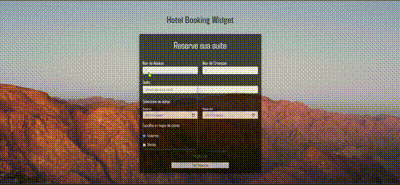

  

  <h5 align="center"> 
    <b>✅ Completo</b> | <b>✅ Responsivo</b>
  </h5>

<h1 align="center">
  
</h1>

## Descrição
O **Hotel Booking Widget** é uma aplicação web que facilita a reserva de suítes em um hotel. A interface é responsiva e moderna, permitindo que os usuários selecionem o número de adultos, crianças, tipo de suíte, datas de check-in e check-out, e até mesmo escolham o tipo de roupa de cama. Esta aplicação foi desenvolvida com **ASP.NET Core MVC** e integra **Bootstrap** para garantir uma experiência amigável ao usuário.

## Funcionalidades
- Seleção de quantidade de adultos e crianças
- Escolha de diferentes tipos de suítes disponíveis
- Escolha de datas de check-in e check-out
- Opção de escolha de roupa de cama de inverno ou verão
- Sistema de reservas e visualização de reservas

## Tecnologias Utilizadas
- **ASP.NET Core MVC**: Framework utilizado para o desenvolvimento do backend e renderização do front-end
- **C#**: Linguagem de programação usada no backend
- **Bootstrap 5**: Para criação de layouts responsivos e estilização
- **HTML/CSS**: Para estrutura e design da interface do usuário
- **JavaScript**: Para funcionalidades interativas na interface
- **W3.CSS**: Framework CSS para design responsivo

## Estrutura do Projeto
- **Views**: Arquivos HTML e Razor utilizados para renderizar o conteúdo dinâmico
- **Controllers**: Gerencia as requisições e as respostas, incluindo o processo de reserva
- **wwwroot**: Contém arquivos estáticos como imagens, CSS e JS

 ---
  

  
  ## 👩🏻‍💻 Autor  
  
  <table>
    <tr>
      <td align="center">
        <a href="https://github.com/robsonlmds">
           
          
            <b>Robson Lucas Messias</b>
          
        </a>
      </td>
    </tr>
  </table>
  
  

   
  <h4 align="center">
    Made by: Robson Lucas Messias | <a href="mailto:robsonlmds@hotmail.com">Contato</a>
  </h4>
  
  

    
  

  
  <h1 align="center">
  
  </h1>
